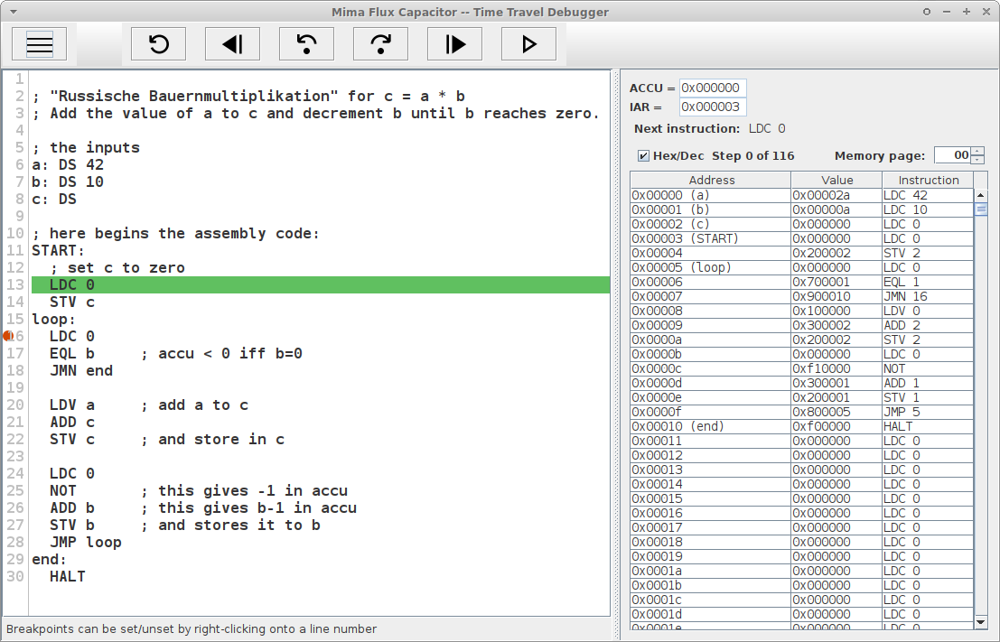

# Mima Flux Capacitator

This tool is a debugger for Mima assembly code.

The [Mima (Minimal
Machine)](https://de.wikipedia.org/wiki/Mikroprogrammierte_Minimalmaschine)
is a teaching model of a simple
[Von-Neumann](https://en.wikipedia.org/wiki/Von_Neumann_architecture)
microprocessor with a pretty limited set of instructions. It is used
in teaching at various universities.

This debugger is a [*time travelling
debugger*](https://en.wikipedia.org/wiki/Time_travel_debugging) which
allows the user to step forward and backward in time, unlike
conventional, sequential debuggers that only support stepping forward
in time. (That's why it is called *Mima [flux
capacitor](https://en.wikipedia.org/wiki/DeLorean_time_machine#Flux_capacitor)*).

This flux capacitor has been derived from an (unpublished) version for
another language and the tool is published under GPL3.

## Plan

1. Running the tool
2. Input language and opcode descriptions
3. Related simulators

## Running the tool

If you have downloaded the JAR file (say `mimaflux.jar`), you can
invoke it like
```
java -jar mimaflux.jar
```

If you have downloaded the sources or cloned the repository, you can
run the tool using
```
./gradlew run
```
or
```
gradlew.bat run
```
on Windows. In both cases, use `--args` to provide command line arguments. 
A jar file can be produced using
```
./gradlew shadowJar
```
with the resulting jar-file then in `build/libs`.

### Command line arguments

An explanation of the command line options can be obtained using
`-help`.

```
Usage: <main class> [options] [<filename>]
      The name of the assembly file 
      to be loaded into the debugger. In -run mode, this file argument must be 
      provided, in GUI mode it is optional.
  Options:
    -help, -h
      Show this usage text
    -maxSteps
      Maximum number of steps to be recorded by mima flux
      Default: 1000
    -print, -p
      Arg: <addr>-<addr>.
      Print the provided memory ranges after 
      finishing the program. Can be specified multiple times for multiple 
      ranges. [only in -run mode]
    -run, -r
      Run without graphical user interface
      Default: false
    -set, -s
      Arg: <addr>=<val>.
      Set a memory location to a specified value. The 
      address addr and the value val can be a number or a label (defined in 
      the assembly code). Can be specified multiple times for multiple ranges. 
      [only in -run mode]
    -test, -t
      Arg: <addr>=<val>.
      Specify a test to be checked at the end of the 
      run. The address and the value val can be a number or a label (defined 
      in the assembly code). Can be specified multiple times for multiple 
      ranges. If at least one address specified in a test contains a different 
      than the specified value, the program terminates with a non-zero exit 
      code [only in -run mode]"
    -verbose
      Give more logs on the console
      Default: false
```

### Running test cases

In order to test an assembly program against a number of test cases,
the following arguments can be used. As an example let the test case
be that the input 42 should yield an output of 23.
```
java -jar mimaflux.jar -run -set in=42 -test out=23
```
This assumes that the assembly code defined two memory labels called 
`in` and `out` (see below).

### Interactive mode

Unless invoked with `-run`, mima flux starts up with the interaction
window:



The menu button allows you to load assembly files from the file
system.

The system executes the program and stores the entire trace (up to a
maximum length that can be set using `-maxSteps`). You can now step
forward and backward through the stored trace -- time travelling since
the conventional sequential execution would not allow you that.

If the value in the IAR points to an address that corresponds to a
location in the code, this line will be highlightes (with a green bar)

#### Breakpoints

Breakpoints can be set by right-clicking on a line in the code. A red
circle marks a breakpoint. When execution is continued (forward or
backward), it will stop at a breakpoint whenever it hits one.

#### Memory Panel

To the right, there is the memory panel. You cannot modify values, but
you can select if values should be printed in hex or dec. The memory
panel below only shows a page of 4096 entries. You can choose to show
a different memory page, however.

## Input language

The assembly source language ressembles many real world languages.

You can find a detailed description of the language in the
[MIM-Assembler
description](https://github.com/cbdevnet/mima/blob/master/mimasm/MIMA-ASSEMBLER.txt). (There
might be slight differences ...)

### Control structures

* The file suffix should be `.mima`
* Comments start with a `;` and end at the next line break
* `* = <INT>` can be used to specify at which location the next statement will be stored in memory.
* Labels are alpahnumeric strings that start with a character.
* `<label> = <INT>` can be used to define a global constant `label` as an abbreviation for `<INT>`.
* Every opcode may be proceeded by a `<label> :` The current address will be stored as a global constant `<label>`.

### Opcodes

OpCode 	| mnemonik	| Description
:------:|:--------------|:-----------
0	| LDC c		| c --> Acc
1	| LDV a		| < a > --> Acc
2	| STV a		| Acc --> < a >
3	| ADD a		| Acc + < a > --> Acc
4	| AND a		| Acc AND < a > --> Acc
5	| OR a		| Acc OR < a > --> Acc
6	| XOR a		| Acc XOR < a > --> Acc
7	| EQL a		| if(Acc == < a >){-1 --> Acc} else {0 --> Acc}
8	| JMP a		| Jump to address a
9	| JMN a		| Jump to address a if acc < 0
A	| LDIV a	| << a >> --> Acc
B	| STIV a	| Acc --> << a >>
C	| JMS a		| jump subroutine (see below)
D	| JIND a	| jump indirect (see below)
E	|		| free
F0	| HALT		| stops the minimal machine
F1	| NOT		| one's complement(Acc) --> Acc
F2	| RAR		| rotates Acc on the the right --> Acc
F3 - FF	|		| free

## Other simulators

* https://mima.informatik.tu-freiberg.de/ They focus more on modelling the mircoprograms of the processor
* https://github.com/Indidev/MiMaSimu
* https://github.com/cbdevnet/mima This simulator uses the same input language.
* http://ti.ira.uka.de/Visualisierungen/Mima/
* https://duckduckgo.com/?q=mima+processor+simulator
